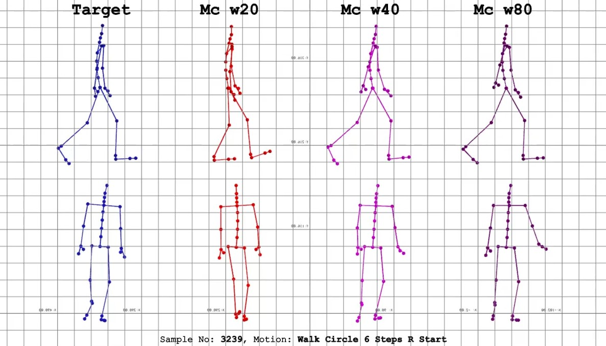

# Online Time Warped Motions
Examples of motions time warped using online time warping algorithms developed Mathew Randall at Birmingham City University.  During the this programme of research, each online time warping algorithm was applied to 3246 pairs of input and target motions.  A selection of the resulting aligned input motions, have been rendered into videos, along with the taregt motion, to visualise the accuracy and quality of the time warped alignment produced. 

# Videos

Each video contains a render of the target motion that the input motion was being aligned to on the right, along with aligned input motions resulting from the time warping algorithm.  

Different on-line time warping algorithms are demonstrated in each video.  The algorithm used to align a given motion is shown above the respective render.  The algorithm that produced the best alignment is always included in the video. 

Videos are located in the videos folder in this repository.  Each video is title based on the ID number given to the pair motions used in the alignment and the motion being performed. 



# Attribution

If you use this work in creation of any publication or artifact, attribute it using the following bibtex:

```
@article{randall2023online,
  title={Online alignment of human motion using forward plotting-dynamic time warping},
  author={Randall, Mathew and Harvey, Carlo and Williams, Ian},
  journal={Computer Animation and Virtual Worlds},
  volume={34},
  number={3-4},
  pages={e2166},
  year={2023},
  publisher={Wiley Online Library}
}
```

Some motions utilised within this research and subsequently depicted in some of the videos in this repository were sourced from the [HDM05 dataset](https://resources.mpi-inf.mpg.de/HDM05/) reference below.

# References
Müller, M., Röder, T., Clausen, M., Eberhardt, B., Krüger, B. and Weber, A., 2007. Mocap database hdm05. *Institut für Informatik II, Universität Bonn*.
